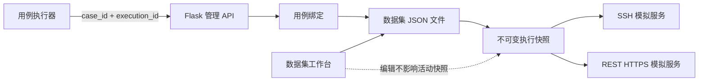

# SmartKit Simulator

SmartKit Simulator 是面向自动化测试和设备联调的本地模拟器。它可以按数据集提供可配置的 SSH 命令响应和 REST HTTPS 路由响应，让测试用例在没有真实存储设备时仍能稳定复现正常、异常和边界场景。

项目由 Python 后端、Web 数据集工作台和 Electron Windows 桌面外壳组成，既可从源码运行，也可构建为无需安装 Python 或 Node.js 的便携版程序。

## 核心功能

- 一个数据集对应一个独立 JSON 文件，完整保存 SSH 和 REST 模拟数据。
- 数据集支持搜索、分页、新建、复制、导入、导出、目录切换和重新扫描。
- SSH/REST 监听地址和端口由全局设置统一持久化，不随数据集切换。
- SSH 命令与 REST 路由支持分组、新增、编辑、移动和删除。
- 可从执行日志批量解析 SSH 命令、REST 路由及响应，经预览后导入。
- 测试用例可以绑定数据集，并在执行前通过 API 激活不可变快照。
- 活动快照与工作台编辑隔离，运行中的测试不会读到中途修改的数据。
- 数据集保存使用 `revision` 乐观锁和临时文件原子替换。
- 提供实时运行日志、SSH/REST 服务控制和 REST 路由测试工具。
- 支持构建 Windows x64 Electron 便携版单文件程序。

## 工作原理



典型用例执行过程：

1. 执行器检查模拟器健康状态。
2. 执行器使用 `case_id` 和唯一的 `execution_id` 激活数据集。
3. 模拟器读取用例绑定和数据集文件，生成不可变执行快照。
4. 用例连接快照提供的 SSH 或 REST 端点执行测试。
5. 用例在 `finally` 中使用相同的 `execution_id` 释放快照。

同一个模拟器实例同一时间只允许一个活动快照。后续激活请求不会覆盖正在执行的快照。

## 快速开始

### 环境要求

- Windows
- Python 3.12+
- PowerShell

### 安装并启动

```powershell
python -m venv .venv
.\.venv\Scripts\Activate.ps1
python -m pip install -r requirements.txt
.\start_gui.ps1
```

也可以直接运行后端：

```powershell
.\.venv\Scripts\python.exe .\simulator_gui.py
```

程序默认打开 `http://127.0.0.1:5800`。如果端口被占用，会自动在 `5801` 到 `5899` 中选择可用端口。

默认协议端点：

- SSH：`127.0.0.1:2222`
- REST HTTPS：`https://127.0.0.1:8080`

快速验证：

```powershell
ssh admin@127.0.0.1 -p 2222 show system general
curl.exe -k -i https://127.0.0.1:8080/redfish/v1/Systems/1
```

REST 服务首次启动时会生成本地自签名证书，并限制使用 TLS 1.2 或 TLS 1.3。

## Windows 桌面版

Electron 桌面版启动时会在后台运行 Python 模拟器后端，收到后端就绪端口后再打开主窗口。关闭桌面窗口时，后端进程也会随之结束。

构建后的便携版不要求目标电脑安装 Python、Node.js 或项目依赖。便携版的运行数据默认保存在程序所在目录，包括：

- `settings.json`
- `datasets/`
- SSH Host Key
- REST TLS 证书和私钥

自动化执行器可以使用固定管理端口和显式数据目录启动同一个便携程序：

```powershell
.\SmartKit-Simulator-1.0.0.exe --automation `
  --management-port 5800 `
  --data-dir D:\code\smartkit\simulator
```

`--automation` 不创建工作台窗口；`--management-port` 端口不可用时启动失败，不会静默切换
到其他端口。执行器应等待 `GET /api/runtime/health` 返回 `ready` 后再控制协议服务或激活用例。

已有管理后端时，可以只打开并附着一个工作台窗口，不再启动第二个后端：

```powershell
.\SmartKit-Simulator-1.0.0.exe --attach-management-url http://127.0.0.1:5800
```

## 数据集

### 数据目录

默认数据集目录是应用数据目录下的 `datasets/`，也可以在界面中切换到其他目录。

```text
datasets/
├── normal-device.json
├── critical-alarm.json
└── .smartkit/
    ├── case-bindings.json
    └── case-catalog.json
```

- `<dataset-id>.json`：一个完整数据集。
- `.smartkit/case-bindings.json`：用例到数据集的绑定关系。
- `.smartkit/case-catalog.json`：外部用例目录的本地元数据镜像。
- `settings.json`：保存当前数据集目录等应用设置。

数据集 ID 创建后不可修改，并决定 JSON 文件名。显示名称可以修改，不影响文件名和已有绑定。

### 数据集示例

```json
{
  "id": "normal-device",
  "name": "正常设备",
  "description": "全量回归使用的正常设备数据",
  "revision": 3,
  "command_groups": ["基础信息"],
  "commands": [
    {
      "group": "基础信息",
      "name": "show system general",
      "description": "查询系统信息",
      "output": "System Health: OK"
    }
  ],
  "rest_groups": ["System"],
  "rest_routes": [
    {
      "group": "System",
      "method": "GET",
      "uri": "/redfish/v1/Systems/1",
      "status_code": 200,
      "response_headers": {"Content-Type": "application/json"},
      "response_body": "{\"Status\":{\"Health\":\"OK\"}}"
    }
  ]
}
```

更新数据集时必须携带当前 `revision`。如果其他编辑已经产生了新修订，服务返回 `409 Conflict`，避免旧页面覆盖新数据。文件写入先落到同目录临时文件，再原子替换目标文件。

## 界面说明

### 数据集工作台

- 数据集列表：搜索、分页、选择、新建、复制、导入和导出。
- 概览：查看数据集说明、修订号、SSH 命令数和 REST 路由数。
- SSH 命令：维护命令响应和命令分组；SSH 登录信息在全局设置中维护。
- REST 路由：维护方法、URI、状态码、响应头、响应体和路由分组。
- 关联用例：同步用例目录，绑定或解除数据集。
- 文件信息：修改显示名称，查看文件路径和内容预览。

### 模拟器运行

- 运行概览：查看活动快照、执行标识、数据集修订号和服务端点。
- SSH / REST：查看当前快照中的只读数据并控制协议服务。
- 运行日志：查看 SSH、REST 和运行时事件，支持拖动调整面板高度。

工作台维护持久化文件；运行页面展示当前快照。保存数据集不会修改已经激活的快照。

## SSH 模拟

SSH 服务的监听地址、端口、用户名和密码来自全局设置，命令响应来自当前数据集。命令按照完整文本精确匹配，参数、管道和反斜杠不会被改写。

命令响应支持以下运行时变量：

| 变量 | 内容 |
|---|---|
| `{date}` | 当前日期 |
| `{time}` | 当前时间 |
| `{datetime}` | 当前日期和时间 |
| `{date_mmdd}` | `MMDD` 日期 |
| `{date_yyyymmdd}` | `YYYYMMDD` 日期 |
| `{sn}` | 随机九位数字 |

### SSH 日志导入

SSH 编辑页可以粘贴执行日志并批量导入：

- `Execute command line :` 用于识别命令。
- 后续的 `Receive str :` 用于识别多行响应。
- 命令与响应按照日志线程配对。
- 命令回显、末尾 `smartkit:/>` 一类提示符和 Java 日志元数据会被清理。
- `Unknown command` 等失败响应会保留，以便复现真实行为。

预览结果分为 `ready`、`duplicate` 和 `missing_response`。新命令默认选中；重复命令可以显式选中并覆盖；缺少响应的记录不能导入。

## REST HTTPS 模拟

REST 服务的监听地址和端口来自全局设置。REST 路由由 HTTP 方法和 URI 共同标识，可以配置状态码、响应头和响应体。

路由支持 `{session_id}` 形式的单段路径参数，参数值可以在响应头和响应体中引用。固定 URI 的匹配优先级高于参数化 URI。

### REST 日志导入

REST 编辑页支持两类日志格式。

Redfish 风格：

```text
##url : /redfish/v1/Chassis ##method : GET
##result : {"Members": []}
```

HttpSession 风格：

```text
Sending GET request to https://127.0.0.1:443/rest/productmgmt/v1/system-info ...
Received GET response successfully from https://127.0.0.1:443/rest/productmgmt/v1/system-info.
ResponseInfo : {"a":"1"}
```

解析规则：

- 请求与响应按照日志线程配对，交错线程互不影响。
- 完整 URL 只保留路径，协议、主机、端口和查询参数会被移除。
- `Received` 必须与请求的 HTTP 方法和 URI 一致。
- 存在合法 JSON `ResponseInfo` 时，将其保存为 JSON 响应体。
- 已记录成功响应但没有响应体时，响应体默认使用 `{}`。
- 没有匹配到成功响应的请求标记为 `missing_response`。
- 重复路由按照“HTTP 方法 + URI”判断，可以显式选择并覆盖已有配置。

完整设计见 [REST 路由日志导入格式扩展](docs/rest-log-import-formats.md)。

## 用例执行器接入

### 激活用例绑定的数据集

```http
POST /api/runtime/activate-case
Content-Type: application/json

{
  "case_id": "TC.Storage.0001",
  "execution_id": "suite-10086-case-0001-attempt-1"
}
```

成功响应包含数据集文件、修订号、校验和以及 SSH/REST 端点。执行器必须等待激活成功后再连接协议服务。

如果已有其他执行持有活动快照，接口返回 `409 Conflict`。使用相同 `case_id` 和 `execution_id` 重试不会创建新的快照。

### 释放快照

```http
POST /api/runtime/release
Content-Type: application/json

{
  "execution_id": "suite-10086-case-0001-attempt-1"
}
```

建议在统一生命周期中保证释放：

```python
activation = simulator.activate(case_id, execution_id)
try:
    run_test_case(activation)
finally:
    simulator.release(execution_id)
```

只有当前快照持有者的 `execution_id` 可以释放快照。

## API 概览

| 能力 | 方法与路径 |
|---|---|
| 查询、切换数据集目录 | `GET /api/dataset-directory`、`POST /api/dataset-directory/switch` |
| 查询、保存全局设置 | `GET /api/settings`、`PUT /api/settings` |
| 校验、扫描数据集目录 | `POST /api/dataset-directory/validate`、`POST /api/dataset-directory/rescan` |
| 查询、新建数据集 | `GET /api/datasets`、`POST /api/datasets` |
| 获取、更新数据集 | `GET /api/datasets/{id}`、`PUT /api/datasets/{id}` |
| 复制、导入、导出数据集 | `POST /api/datasets/{id}/copy`、`POST /api/datasets/import`、`GET /api/datasets/{id}/export` |
| 同步、查询用例目录 | `POST /api/cases/sync`、`GET /api/cases` |
| 查询、维护用例绑定 | `GET /api/bindings`、`PUT/DELETE /api/bindings/{case_id}` |
| 运行健康与状态 | `GET /api/runtime/health`、`GET /api/runtime/status` |
| 激活、释放用例快照 | `POST /api/runtime/activate-case`、`POST /api/runtime/release` |
| 手工激活数据集 | `POST /api/runtime/activate-dataset` |
| 日志导入预览 | `POST /api/ssh/import-log/preview`、`POST /api/rest/import-log/preview` |
| SSH 服务控制 | `POST /api/server/start`、`POST /api/server/stop` |
| REST 服务控制 | `POST /api/rest/start`、`POST /api/rest/stop` |
| REST 路由测试 | `POST /api/rest/test` |
| 运行日志与服务状态 | `GET /api/logs`、`GET /api/services/status` |

## 测试

运行全部 Python 回归测试：

```powershell
.\.venv\Scripts\python.exe -m unittest discover -s tests
```

运行生产数据集界面测试：

```powershell
node .\tests\test_production_ui.js
```

运行早期兼容界面测试：

```powershell
node .\tests\test_index_html.js
```

测试覆盖数据集持久化与冲突、用例绑定、运行快照、SSH/REST 服务、日志导入、桌面便携性和前端主要交互。

## 构建 Windows 桌面应用

构建过程分为两步：先使用 PyInstaller 生成独立的 Python 后端，再由 electron-builder 封装为 Windows x64 便携版。

### 构建环境

- Windows x64
- Python 3.12+
- Node.js 和 npm
- .NET Framework 4.x
- 可访问 npm 和 Electron 构建依赖下载地址

构建脚本使用 `.NET Framework` 自带的 `csc.exe` 编译 7-Zip 包装器，并默认使用 npmmirror 的 Electron Builder 二进制镜像。

### 首次准备

```powershell
python -m venv .venv
.\.venv\Scripts\Activate.ps1
python -m pip install -r requirements.txt

Push-Location .\electron
npm install
Pop-Location
```

### 一键构建

```powershell
powershell -ExecutionPolicy Bypass -File .\build_electron.ps1 -Clean
```

主要产物：

```text
dist/backend/simulator_gui.exe
electron/dist/SmartKit-Simulator-1.0.0.exe
```

最终交付文件为 `electron/dist/SmartKit-Simulator-1.0.0.exe`。

### 分步构建和开发运行

```powershell
# 只构建 Python 后端
powershell -ExecutionPolicy Bypass -File .\build_backend.ps1 -Clean

# 复用已有后端，只封装 Electron
powershell -ExecutionPolicy Bypass -File .\build_electron.ps1 -SkipBackend

# Electron 开发模式
Push-Location .\electron
npm start
Pop-Location
```

开发模式优先使用项目中的 `.venv\Scripts\python.exe`。

### 构建参数

| 参数 | 适用脚本 | 说明 |
|---|---|---|
| `-Clean` | 两个构建脚本 | 清理旧产物后重新构建 |
| `-SkipBackend` | `build_electron.ps1` | 复用已有的 `dist/backend/simulator_gui.exe` |
| `-PythonPath <path>` | `build_backend.ps1`、`start_gui.ps1` | 指定 Python 解释器 |

### 常见构建问题

- 缺少 Python 模块：运行 `.\.venv\Scripts\python.exe -m pip install -r requirements.txt`。
- 缺少 Electron 或 electron-builder：进入 `electron` 目录运行 `npm install`。
- 找不到 C# 编译器：检查 `C:\Windows\Microsoft.NET\Framework64\v4.0.30319\csc.exe`。
- 旧构建文件被占用：关闭正在运行的 SmartKit Simulator 后使用 `-Clean` 重试。
- 后端构建成功但 Electron 失败：确认 `dist/backend/simulator_gui.exe` 存在，再使用 `-SkipBackend` 重试。

## 项目结构

```text
simulator/
├── simulator_gui.py                    # Flask API、SSH/REST 服务和运行快照
├── dataset_workspace.py                # 数据集、用例绑定和原子持久化
├── prototype_dataset_ui_a_full.html    # 当前生产数据集工作台与运行界面
├── index.html                          # 早期单配置界面，保留兼容与测试
├── datasets/                           # 默认数据集目录
├── docs/
│   ├── simulator-dataset-architecture.md
│   └── rest-log-import-formats.md
├── electron/                           # Electron 桌面外壳和构建配置
├── tests/                              # Python 与前端回归测试
├── start_gui.ps1                       # 源码运行脚本
├── build_backend.ps1                   # PyInstaller 后端构建脚本
├── build_electron.ps1                  # Electron Windows 构建脚本
└── requirements.txt                    # Python 运行与构建依赖
```

`run.ps1` 和 `server.py` 属于早期 CLI SSH 模式；新功能应优先使用 `simulator_gui.py`。

## 安全与使用限制

- 本项目用于开发、联调和自动化测试，不应作为生产设备服务使用。
- 管理服务默认仅监听本机地址，不建议直接暴露到不可信网络。
- SSH 用户名和密码保存在 `settings.json`，数据集只包含设备命令与 REST 响应。
- 将 SSH 或 REST 地址改为 `0.0.0.0` 时，需要同步限制网络访问并配置 Windows 防火墙。
- REST 使用本地自签名证书；联调客户端应显式信任证书，或仅在测试环境跳过校验。
- 单个实例同一时间只能运行一个活动数据集快照。

## 延伸文档

- [数据集架构设计](docs/simulator-dataset-architecture.md)：数据模型、执行时序、失败处理和 E2E 接入设计。
- [REST 路由日志导入格式扩展](docs/rest-log-import-formats.md)：支持格式、线程配对、默认响应和重复处理规则。
