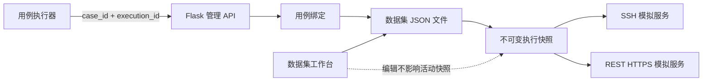

# SmartKit Simulator

SmartKit Simulator 是面向自动化测试的本地设备模拟器，提供可配置的 SSH 命令响应和 REST HTTPS 路由响应。项目通过“一个数据集一个 JSON 文件”和“用例执行前生成不可变快照”隔离不同测试场景，避免全量用例执行时模拟数据相互串用。

项目提供 Flask 管理服务、Web 数据集工作台和 Electron Windows 桌面封装，也可直接使用 Python 运行。

## 核心能力

- 一个数据集完整保存在一个独立 JSON 文件中。
- 数据集目录可配置、校验、切换和重新扫描。
- 数据集支持搜索、分页、新建、复制、导入、导出和修改显示名称。
- SSH 命令与 REST 路由支持分组、新增、编辑、移动和删除。
- SSH 命令可从执行日志解析命令与多行响应，并经预览后批量导入。
- REST 路由可从 Redfish 请求日志解析并批量导入。
- 多个测试用例可以复用同一数据集，用例与数据集的关系在工作台维护。
- 用例执行器按 `case_id` 激活对应数据集，并通过显式的 `execution_id` 标识和释放运行快照。
- 运行期间 SSH 与 REST 服务读取不可变快照；工作台继续编辑文件不会影响本次执行。
- 数据集更新使用 `revision` 乐观锁，过期保存返回冲突，文件通过临时文件原子替换。
- 运行概览、SSH 和 REST 页面底部均提供实时日志面板。
- 列表/编辑器支持左右拖动，内容/日志支持上下拖动；尺寸在浏览器中持久化。

## 工作原理



典型执行流程：

1. 用例执行器调用健康检查。
2. 执行器使用 `case_id` 和唯一 `execution_id` 请求激活。
3. 模拟器解析用例绑定，读取并校验数据集文件，创建执行快照。
4. 用例通过 SSH 或 REST 访问模拟服务。
5. 用例结束后，执行器在 `finally` 中使用相同的 `execution_id` 释放快照。

同一模拟器实例同一时间只允许一个活动快照。后到的激活请求不会覆盖正在执行的数据。

## 数据目录

默认数据集目录为应用数据目录下的 `datasets/`，也可以在界面中切换到其他目录。

```text
datasets/
├── normal-device.json
├── critical-alarm.json
└── .smartkit/
    ├── case-bindings.json
    └── case-catalog.json
```

- `<dataset-id>.json`：单个完整数据集。
- `.smartkit/case-bindings.json`：用例到数据集的绑定关系。
- `.smartkit/case-catalog.json`：外部用例目录的本地元数据镜像。
- 应用目录下的 `settings.json`：保存当前数据集目录配置。

数据集 ID 创建后不可修改，它同时决定文件名；数据集显示名称可以修改，不影响文件名和已有用例绑定。

### 数据集示例

```json
{
  "id": "normal-device",
  "name": "正常设备",
  "description": "全量回归使用的正常设备数据",
  "revision": 3,
  "server": {
    "bind_address": "127.0.0.1",
    "port": 2222,
    "username": "admin",
    "password": "admin123"
  },
  "command_groups": ["基础信息"],
  "commands": [
    {
      "group": "基础信息",
      "name": "show system general",
      "description": "查询系统信息",
      "output": "System Health: OK"
    }
  ],
  "rest_server": {
    "bind_address": "127.0.0.1",
    "port": 8080
  },
  "rest_groups": ["System"],
  "rest_routes": [
    {
      "group": "System",
      "method": "GET",
      "uri": "/redfish/v1/Systems/1",
      "status_code": 200,
      "response_headers": {"Content-Type": "application/json"},
      "response_body": "{\"Status\":{\"Health\":\"OK\"}}"
    }
  ]
}
```

## 界面说明

### 数据集工作台

- 数据集列表：搜索、分页和选择数据集。
- 概览：查看 SSH 命令、REST 路由、修订号和标签摘要。
- SSH 命令：维护认证信息、命令响应及命令分组。
- REST 路由：维护方法、URI、状态码、响应头、响应体及路由分组。
- 关联用例：分页查看、绑定和解除测试用例。
- 文件信息：修改数据集名称、查看文件路径和内容预览。

### 模拟器运行

- 运行概览：查看活动快照、执行标识、数据集修订号和服务端点。
- SSH / REST：查看当前快照中的只读协议数据并控制服务。
- 运行日志：嵌入各运行页面底部，可拖动调整高度。

工作台负责维护持久化文件；运行页面展示当前快照。两者刻意分离。

## 快速开始

要求 Python 3.12+。

```powershell
python -m venv .venv
.\.venv\Scripts\Activate.ps1
python -m pip install -r requirements.txt
.\start_gui.ps1
```

也可以直接启动：

```powershell
.\.venv\Scripts\python.exe .\simulator_gui.py
```

默认访问地址为 `http://127.0.0.1:5800`。如果端口被占用，程序会在 `5801` 至 `5899` 中选择可用端口。

默认协议端点：

- SSH：`127.0.0.1:2222`
- REST HTTPS：`https://127.0.0.1:8080`

REST 服务首次启动时会生成本地自签名证书，并限制使用 TLS 1.2 或 TLS 1.3。

## 用例执行器接入

### 激活用例绑定的数据集

```http
POST /api/runtime/activate-case
Content-Type: application/json

{
  "case_id": "TC.Storage.0001",
  "execution_id": "suite-10086-case-0001-attempt-1"
}
```

成功响应包含数据集文件、修订号、校验和以及 SSH/REST 端点。执行器必须等待激活成功后再建立协议连接。

### 释放快照

```http
POST /api/runtime/release
Content-Type: application/json

{
  "execution_id": "suite-10086-case-0001-attempt-1"
}
```

建议执行器封装统一生命周期：

```python
activation = simulator.activate(case_id, execution_id)
try:
    run_test_case(activation)
finally:
    simulator.release(execution_id)
```

## 主要管理 API

| 能力 | 方法与路径 |
|---|---|
| 查询/切换数据集目录 | `GET /api/dataset-directory`、`POST /api/dataset-directory/switch` |
| 校验/扫描目录 | `POST /api/dataset-directory/validate`、`POST /api/dataset-directory/rescan` |
| 数据集分页、新建 | `GET /api/datasets`、`POST /api/datasets` |
| 数据集详情、更新 | `GET /api/datasets/{id}`、`PUT /api/datasets/{id}` |
| 复制、导入、导出 | `POST /api/datasets/{id}/copy`、`POST /api/datasets/import`、`GET /api/datasets/{id}/export` |
| 同步/查询用例目录 | `POST /api/cases/sync`、`GET /api/cases` |
| 查询/维护绑定 | `GET /api/bindings`、`PUT/DELETE /api/bindings/{case_id}` |
| 运行健康与状态 | `GET /api/runtime/health`、`GET /api/runtime/status` |
| 激活/释放 | `POST /api/runtime/activate-case`、`POST /api/runtime/release` |
| 手工激活数据集 | `POST /api/runtime/activate-dataset` |
| 日志导入预览 | `POST /api/ssh/import-log/preview`、`POST /api/rest/import-log/preview` |
| SSH/REST 服务控制 | `POST /api/server/start|stop`、`POST /api/rest/start|stop` |

## REST 和 SSH 模拟

SSH 命令输出支持运行时变量：`{date}`、`{time}`、`{datetime}`、`{date_mmdd}`、`{date_yyyymmdd}` 和随机九位数字 `{sn}`。

SSH 命令编辑页支持粘贴执行日志批量导入。解析器使用 `Execute command line :` 识别命令，使用后续 `Receive str :` 识别多行响应，并按日志线程及命令回显进行配对。预览会区分可导入、重复和缺少响应的记录：新记录默认勾选；重复记录默认不勾选但允许用户显式选择并覆盖现有命令；缺少响应的记录不可选择。导入时会去掉命令回显、末尾 `smartkit:/>` 一类提示符及 Java 日志元数据，但会保留 `Unknown command` 等失败响应，以便复现真实设备行为。命令名称按完整文本精确去重，管道、参数和反斜杠不会被改写。

REST 日志导入采用相同的选择规则。重复路由按“HTTP 方法 + URI”识别，用户显式勾选后会使用日志中的状态码、响应头、响应体和目标分组替换现有路由。

REST 路由按 HTTP 方法和 URI 匹配，支持 `{session_id}` 形式的单段路径参数，并可在响应头和响应体中引用参数值。固定 URI 的匹配优先级高于参数化 URI。

调用示例：

```powershell
ssh admin@127.0.0.1 -p 2222 show system general
curl.exe -k -i https://127.0.0.1:8080/redfish/v1/Systems/1
```

## 测试

运行 Python 测试：

```powershell
.\.venv\Scripts\python.exe -m unittest discover -s tests
```

运行生产数据集界面检查：

```powershell
node .\tests\test_production_ui.js
```

早期 `index.html` 界面仍有独立的前端行为测试：

```powershell
node .\tests\test_index_html.js
```

## 打包 Electron Windows 桌面应用

项目采用两阶段打包：先使用 PyInstaller 将 Flask、SSH 和 REST 后端构建为独立的 `simulator_gui.exe`，再由 electron-builder 将 Electron 外壳和后端封装为 Windows x64 便携版单文件程序。

目标电脑不需要安装 Python、Node.js 或项目依赖。Electron 启动后会在后台运行模拟器后端，等待后端报告管理端口，再打开桌面窗口；关闭窗口时会同时结束后端进程。

### 构建环境

- Windows x64。
- Python 3.12+。
- Node.js 和 npm。
- .NET Framework 4.x；脚本使用 `C:\Windows\Microsoft.NET\Framework64\v4.0.30319\csc.exe` 编译 7-Zip 包装器。
- 能访问 npm/Electron 构建依赖下载地址；脚本默认使用 npmmirror 的 Electron Builder 二进制镜像。

### 首次准备

```powershell
python -m venv .venv
.\.venv\Scripts\Activate.ps1
python -m pip install -r requirements.txt

Push-Location .\electron
npm install
Pop-Location
```

`requirements.txt` 已包含运行依赖和 PyInstaller，`electron/package.json` 已包含 Electron 及 electron-builder。

### 一键构建

```powershell
powershell -ExecutionPolicy Bypass -File .\build_electron.ps1 -Clean
```

脚本依次完成：

1. 调用 `build_backend.ps1` 检查 Python 依赖。
2. 将 `simulator_gui.py`、生产界面、兼容界面和默认配置打包为后端程序。
3. 将后端放入 Electron 的 `resources/backend/`。
4. 使用 electron-builder 生成 Windows portable 单文件应用。
5. 检查最终程序是否生成成功。

主要产物：

```text
dist/backend/simulator_gui.exe
electron/dist/SmartKit-Simulator-1.0.0.exe
```

最终交付 `electron/dist/SmartKit-Simulator-1.0.0.exe`。复制到目标 Windows 电脑后即可双击运行。便携版运行数据默认保存在可执行文件所在目录，包括 `settings.json`、数据集、SSH Host Key 和 REST TLS 证书。

### 分步构建与开发运行

```powershell
# 只重新构建 Python 后端
powershell -ExecutionPolicy Bypass -File .\build_backend.ps1 -Clean

# 复用已有后端，只重新封装 Electron
powershell -ExecutionPolicy Bypass -File .\build_electron.ps1 -SkipBackend

# 开发模式直接运行 Electron，不生成发布文件
Push-Location .\electron
npm start
Pop-Location
```

开发模式优先使用项目中的 `.venv\Scripts\python.exe` 启动 `simulator_gui.py`。

### 构建参数

| 参数 | 适用脚本 | 说明 |
|---|---|---|
| `-Clean` | 两个构建脚本 | 删除旧构建产物后重新构建 |
| `-SkipBackend` | `build_electron.ps1` | 复用 `dist/backend/simulator_gui.exe` |
| `-PythonPath <path>` | `build_backend.ps1` | 指定构建使用的 Python 解释器 |

### 常见问题

- 缺少 Python 模块：运行 `.\.venv\Scripts\python.exe -m pip install -r requirements.txt`。
- 缺少 Electron 或 electron-builder：进入 `electron` 目录运行 `npm install`。
- 找不到 C# 编译器：确认 `.NET Framework 4.x` 已安装，并检查 `Test-Path C:\Windows\Microsoft.NET\Framework64\v4.0.30319\csc.exe`。
- 旧构建文件被占用：关闭正在运行的 SmartKit Simulator，再使用 `-Clean` 构建。
- 后端成功但 Electron 失败：确认 `dist/backend/simulator_gui.exe` 存在，再使用 `-SkipBackend` 重试。

## 项目结构

```text
simulator/
├── simulator_gui.py                    # Flask API、SSH/REST 服务和运行快照
├── dataset_workspace.py                # 数据集文件、分页、绑定和原子持久化
├── prototype_dataset_ui_a_full.html    # 当前生产数据集工作台与运行界面
├── index.html                          # 早期单配置界面，保留兼容与测试
├── datasets/                           # 默认数据集目录
├── docs/
│   └── simulator-dataset-architecture.md
├── electron/                           # Electron 桌面封装
├── tests/                              # Python 与前端回归测试
├── start_gui.ps1                       # 开发模式启动脚本
├── build_backend.ps1                   # 后端构建脚本
└── build_electron.ps1                  # Electron Windows 构建
```

更完整的数据模型、执行时序、失败处理和 E2E 接入设计见 [docs/simulator-dataset-architecture.md](docs/simulator-dataset-architecture.md)。

## 安全与使用注意

- 管理服务默认仅监听本机地址，不建议直接暴露到不可信网络。
- 数据集可能包含 SSH 用户名、密码和设备响应数据，导出或共享前应检查敏感信息。
- 将 SSH/REST 监听地址改为 `0.0.0.0` 时，需要同时配置 Windows 防火墙和网络访问范围。
- REST 默认使用自签名证书；联调客户端需要显式信任证书或仅在测试环境跳过证书校验。
- `run.ps1` 和 `server.py` 属于早期 CLI SSH 模式，新功能应优先使用 `simulator_gui.py`。
