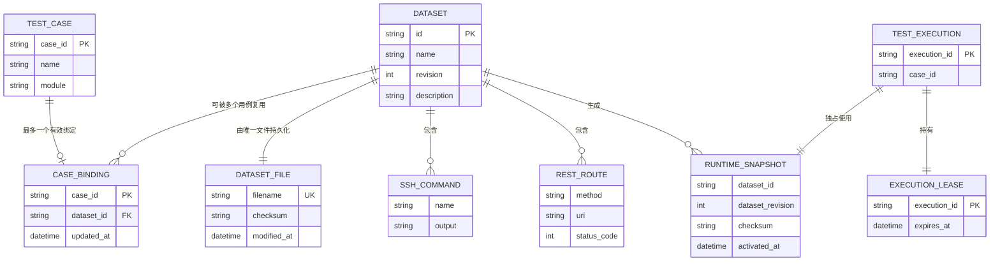
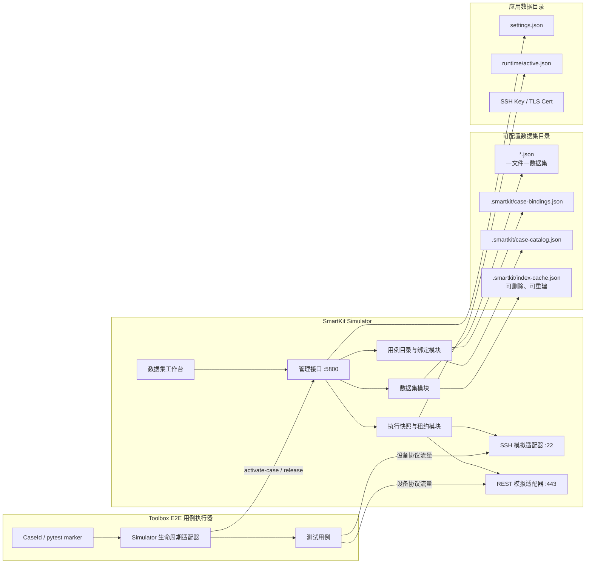
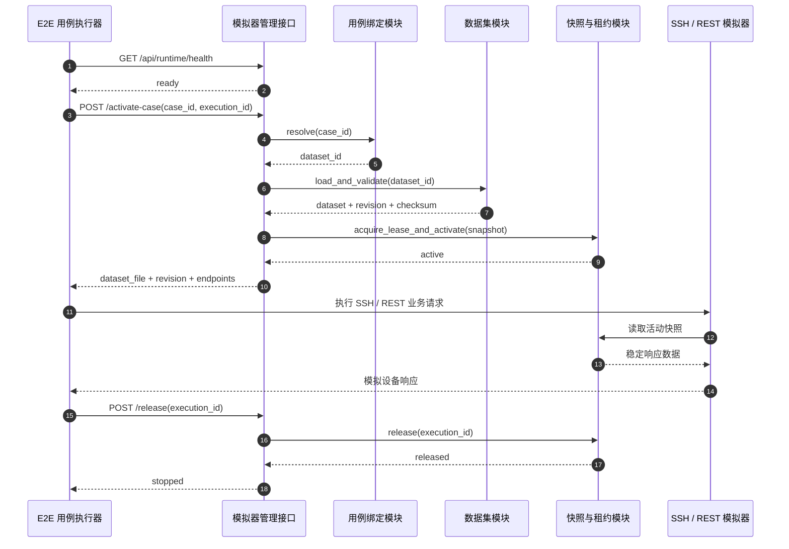
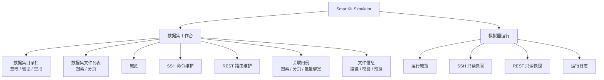

# SmartKit Simulator 多数据集方案设计

> 状态：已完成首版代码实现  
> 更新时间：2026-08-17  
> 配套原型：[`prototype_dataset_ui_a_full.html`](../prototype_dataset_ui_a_full.html)

## 1. 背景

SmartKit Simulator 当前将监听配置、SSH 认证与命令响应、REST 路由响应集中保存在同一个 `config.json` 中。SSH 和 REST 在运行时读取该文件，因此执行需要不同模拟数据的全量用例时，容易发生用例间数据串用。

目标是在模拟器提前启动的前提下，由用例执行器在每条用例开始前加载正确的数据集，并确保执行期间的数据稳定、可追踪、可复现。

## 2. 已确认的设计决策

1. 一个模拟数据集可以被多个测试用例复用。
2. 一个测试用例默认只有一个有效数据集绑定。
3. 用例与数据集的绑定关系在数据集工作台维护。
4. 每个数据集完整保存在一个独立 JSON 文件中，不拆分为多个版本文件。
5. 数据集目录可配置；切换目录后重新扫描，但不影响已经激活的执行快照。
6. 数据集和用例数量均按 5000 级规模设计，列表使用后端分页、搜索和筛选。
7. 一级界面只保留“数据集工作台”和“模拟器运行”。SSH、REST 是模拟器运行页的内部视图。
8. 单个模拟器实例同一时刻只允许一个活动执行；并行用例使用多个模拟器实例和不同端口。
9. 测试用例使用稳定 `case_id` 绑定，不能用可能变化或重复的用例名称作为主键。

## 3. 领域模型



### 3.1 核心约束

- `dataset_id` 创建后不可修改，并且必须能安全映射为文件名。
- 数据集文件名固定为 `<dataset_id>.json`。
- 同一个 `case_id` 在关系文件中最多出现一次。
- 删除或归档被用例绑定的数据集时必须提示影响范围。
- 运行快照是激活时的数据副本；后续编辑数据集文件不能改变该快照。
- `revision` 是当前文件的修订号，用于并发更新检查和日志追踪，不代表模拟器保存了历史文件。
- 如需历史版本，应由 Git、备份系统或外部制品库承担，不在数据集目录内创建 `revisions/`。

## 4. 总体架构



### 4.1 模块与接口

| 模块 | 对外接口 | 隐藏的实现复杂度 |
|---|---|---|
| 数据集模块 | 分页查询、读取、创建、保存、导入、导出、归档、扫描目录 | 文件校验、原子保存、文件名安全、缓存重建、文件监听 |
| 用例目录与绑定模块 | 同步用例目录、分页查询用例、绑定、解绑、批量导入 | `case_id` 唯一性、失效绑定检测、关系文件原子更新 |
| 执行快照与租约模块 | 按用例激活、查询状态、释放 | 绑定解析、快照复制、并发互斥、超时接管、错误回滚 |
| SSH 模拟适配器 | 标准 SSH 协议 | 从活动快照读取认证与命令响应 |
| REST 模拟适配器 | 标准 HTTPS 协议 | 从活动快照匹配方法、URI、参数和响应 |
| E2E 生命周期适配器 | `activate(case_id)` / `release(execution_id)` | 管理接口调用、重试、超时、失败归类、`finally` 清理 |

调用方不直接读取数据集文件，也不需要知道目录、文件扫描或绑定文件格式。

## 5. 文件存储方案

### 5.1 应用数据目录

应用自身始终可定位的目录保存全局设置和运行状态：

```text
app-data/
├── settings.json
├── runtime/
│   └── active.json
└── security/
    ├── host_key
    ├── rest_cert.pem
    └── rest_key.pem
```

`settings.json` 示例：

```json
{
  "schema_version": 1,
  "dataset_directory": "D:\\SmartKit-Simulator\\datasets",
  "management_server": {
    "bind_address": "127.0.0.1",
    "port": 5800
  },
  "ssh_server": {
    "bind_address": "0.0.0.0",
    "port": 22
  },
  "rest_server": {
    "bind_address": "0.0.0.0",
    "port": 443
  },
  "lease_timeout_seconds": 1800
}
```

### 5.2 可配置数据集目录

```text
D:\SmartKit-Simulator\datasets\
├── normal-device.json
├── critical-alarm.json
├── login-failed.json
└── .smartkit\
    ├── case-bindings.json
    ├── case-catalog.json
    └── index-cache.json
```

- `*.json`：权威数据集文件，一个文件只保存一个数据集。
- `case-bindings.json`：跨数据集的用例绑定关系。
- `case-catalog.json`：外部 E2E 用例元数据的本地镜像，不是用例权威来源。
- `index-cache.json`：加速大目录启动和分页，可随时删除并从数据集文件重建。

### 5.3 数据集文件

```json
{
  "schema_version": 1,
  "id": "critical-alarm",
  "name": "设备存在严重告警",
  "description": "用于验证严重告警发现和上报流程",
  "revision": 3,
  "tags": ["alarm", "redfish"],
  "created_at": "2026-08-17T10:00:00+08:00",
  "updated_at": "2026-08-17T11:30:00+08:00",
  "ssh": {
    "auth": {
      "username": "admin",
      "password": "admin123"
    },
    "groups": ["System", "Alarm"],
    "commands": [
      {
        "name": "show alarm",
        "description": "查询当前告警",
        "group": "Alarm",
        "output": "Critical alarm detected"
      }
    ]
  },
  "rest": {
    "groups": ["Redfish"],
    "routes": [
      {
        "method": "GET",
        "uri": "/redfish/v1/SystemOverview",
        "group": "Redfish",
        "status_code": 200,
        "response_headers": {
          "Content-Type": "application/json"
        },
        "response_body": "{\"CriticalAlarmCount\":1}"
      }
    ]
  }
}
```

监听地址、端口、证书和执行租约不能放入数据集文件，因为它们是进程级设置，不应随测试场景切换。

### 5.4 用例绑定文件

使用以 `case_id` 为键的对象，保证唯一绑定并提供常数时间查找：

```json
{
  "schema_version": 1,
  "bindings": {
    "TC.SmartKit.Web.DeviceManagement.Storage.Add.001": {
      "dataset_id": "normal-device",
      "updated_at": "2026-08-17T12:00:00+08:00"
    },
    "TC.SmartKit.Web.DeviceManagement.Storage.Update.002": {
      "dataset_id": "critical-alarm",
      "updated_at": "2026-08-17T12:05:00+08:00"
    }
  }
}
```

## 6. 数据集目录切换

目录切换按以下顺序执行：

1. 检查当前编辑内容是否已保存。
2. 解析并规范化绝对路径。
3. 验证目录存在、可读、可写；必要时由用户明确创建。
4. 扫描 `*.json`，校验文件名、Schema、`dataset_id` 唯一性。
5. 读取或重建 `.smartkit/index-cache.json`。
6. 校验用例目录和绑定关系，报告不存在的数据集或用例。
7. 扫描全部成功后，原子更新应用 `settings.json` 中的 `dataset_directory`。
8. 刷新工作台；当前 `runtime/active.json` 保持不变。

任何一步失败都不能切换到半有效目录，也不能清空当前活动快照。

## 7. 大规模数据与分页

### 7.1 数据集

- 数据集列表由后端分页，前端不一次加载全部文件内容。
- 扫描阶段只建立元数据索引；选中数据集时才读取完整 SSH/REST 内容。
- 缓存使用 `path + size + modified_at` 判断是否可复用。
- 文件监听只增量更新变化项；手工“重新扫描”可完成全量修复。
- 默认每页 20 条，可选择 50 或 100 条。

### 7.2 用例目录与绑定

- 5000+ 用例通过 `case_id`、名称、模块和绑定状态分页查询。
- 绑定界面支持批量选择、CSV/JSON 导入和重新绑定确认。
- 用例目录只保存元数据，不复制测试代码。
- 删除或改名的 `case_id` 显示为失效绑定，不能静默丢弃。

建议分页接口参数：

```text
page, page_size, keyword, module, binding_status, dataset_id, sort
```

## 8. 管理接口

### 8.1 数据集与目录

```http
GET  /api/datasets?page=1&page_size=20&keyword=alarm
POST /api/datasets
GET  /api/datasets/{dataset_id}
PUT  /api/datasets/{dataset_id}
POST /api/datasets/{dataset_id}/copy
POST /api/datasets/import
GET  /api/datasets/{dataset_id}/export
POST /api/dataset-directory/validate
POST /api/dataset-directory/switch
POST /api/dataset-directory/rescan
```

保存数据集时必须携带调用方读取到的 `revision`。服务端发现文件已被其他窗口修改时返回 `409 Conflict`，不得静默覆盖。

### 8.2 用例目录与绑定

```http
POST   /api/cases/sync
GET    /api/cases?page=1&page_size=20&keyword=Storage
GET    /api/bindings?dataset_id=critical-alarm&page=1&page_size=20
PUT    /api/bindings/{case_id}
DELETE /api/bindings/{case_id}
POST   /api/bindings/import
```

### 8.3 运行控制

```http
GET  /api/runtime/health
GET  /api/runtime/status
POST /api/runtime/activate-case
POST /api/runtime/release
```

激活请求只需要稳定用例标识：

```json
{
  "case_id": "TC.SmartKit.Web.DeviceManagement.Storage.Add.001",
  "execution_id": "suite-10086-attempt-1"
}
```

模拟器负责解析绑定并返回实际加载结果：

```json
{
  "status": "active",
  "case_id": "TC.SmartKit.Web.DeviceManagement.Storage.Add.001",
  "execution_id": "suite-10086-attempt-1",
  "dataset_id": "normal-device",
  "dataset_file": "normal-device.json",
  "dataset_revision": 5,
  "checksum": "sha256:...",
  "ssh_endpoint": "127.0.0.1:22",
  "rest_endpoint": "https://127.0.0.1:443"
}
```

## 9. 用例执行时序



执行器必须在 `finally` 中释放。激活成功前不得建立本用例的 SSH 会话或发送 REST 请求；释放前必须关闭本用例连接。

## 10. Toolbox E2E 接入设计

实际 E2E 仓库已经提供稳定的 `CaseId`：

- `tests/conftest.py` 在收集阶段把注册表中的 `case_id` 添加为 pytest marker。
- class-based 用例通过 `TestCase.run()` 执行 `preTestCase → procedure → postTestCase` 生命周期。

建议新增一个深模块“Simulator 生命周期适配器”，向两类入口提供同一个小接口：

```text
activate(case_id, execution_id) -> Activation
release(execution_id) -> None
```

接入位置：

- pytest 用例：autouse fixture 从 `request.node` 的 `case_id` marker 获取标识，在 `yield` 前激活、`finally` 中释放。
- standalone/class-based 用例：`TestCase.preTestCase` 激活，`postTestCase` 的 `finally` 释放。
- 两者共用同一个客户端、错误分类和重试策略，不能各自拼装 HTTP 请求。

环境配置建议增加：

```json
{
  "simulator": {
    "management_url": "http://127.0.0.1:5800",
    "required": true,
    "activation_timeout_ms": 10000
  }
}
```

## 11. 界面架构



工作台负责维护；运行页只展示当前快照并提供协议联调，不直接修改数据集文件。

## 12. 一致性与失败处理

| 场景 | 预期行为 |
|---|---|
| 数据集 JSON 无效 | 标记文件错误，不加入可激活列表；其他文件继续可用 |
| 文件名与 `dataset_id` 不一致 | 拒绝加载并提示修复 |
| 重复 `dataset_id` | 目录扫描失败并列出冲突文件 |
| 保存中断 | 保留旧文件；临时文件不作为数据集读取 |
| 数据集被外部程序修改 | 通过 `revision`/文件状态发现冲突并返回 409 |
| 用例没有绑定 | 激活返回 404/业务错误 `binding_not_found`，用例不执行 |
| 绑定的数据集文件不存在 | 激活返回 `dataset_missing`，工作台显示失效绑定 |
| 其他执行占用模拟器 | 激活返回 409 `runtime_busy`，不得覆盖快照 |
| 用例进程崩溃未释放 | 租约超时后允许新执行接管，并记录审计日志 |
| 切换目录失败 | 保持旧目录和活动快照，不进入半切换状态 |

数据集文件、绑定文件、设置文件和活动快照均采用“同目录临时文件写入 → flush → 原子替换”。

## 13. 安全与权限

- 管理接口默认只监听 `127.0.0.1`。
- 远程管理必须配置访问令牌，并限制可访问网段。
- 数据集路径必须规范化，禁止 `..`、绝对文件名注入和目录逃逸。
- 工作台可创建和修改数据；执行器默认只能健康检查、激活、查询状态和释放。
- 密码在界面中默认掩码显示；导出文件时明确提示其中可能包含认证信息。

## 14. 旧配置迁移

首次升级检测到旧 `config.json` 时：

1. 将 SSH/REST 监听地址和端口迁移到应用 `settings.json`。
2. 将 SSH 认证、SSH 命令和 REST 路由写入 `default.json`。
3. 创建空的 `.smartkit/case-bindings.json` 和 `case-catalog.json`。
4. 校验并激活 `default.json`，保持升级前行为。
5. 保留旧 `config.json` 备份，但不再作为运行数据源。

## 15. 实施阶段建议

### 阶段一：数据层

- 配置数据集目录。
- 一文件一数据集的 Schema、校验、扫描、分页、原子保存。
- 旧 `config.json` 迁移。
- 用例目录与绑定文件。

### 阶段二：运行控制

- 按 `case_id` 激活数据集。
- 不可变活动快照、租约、释放和审计日志。
- SSH/REST 统一读取活动快照。

### 阶段三：工作台界面

- 数据集分页、搜索、创建、复制、导入、导出。
- SSH 命令和 REST 路由维护。
- 5000+ 用例分页和批量绑定。
- 文件信息、目录切换和失效关系提示。

### 阶段四：E2E 接入

- 同步用例目录。
- pytest fixture 和 class-based 生命周期适配。
- 环境配置、错误分类和集成测试。

## 16. 验收标准

1. 两个不同数据集绑定的用例串行执行时，响应数据不串用。
2. 多个用例可以绑定并复用同一数据集文件。
3. 同一个用例不能同时存在两个有效绑定。
4. 保存数据集只修改对应的一个 JSON 文件。
5. 工作台可以切换到另一个有效目录，并分页展示 5000 个数据集文件。
6. 工作台可以分页展示 5000+ 用例并维护绑定。
7. 切换目录或编辑文件不影响活动快照。
8. 用例执行器只传 `case_id` 和 `execution_id` 即可激活正确数据集。
9. 并发激活同一实例时，后到请求收到明确的 409 冲突。
10. 任何激活、保存或目录切换失败都不会破坏上一次有效数据和运行状态。

## 17. 非目标

- 单实例并行运行多个数据集。
- 数据集继承或基础数据集叠加。
- 在模拟器中维护测试代码。
- 在数据集目录中保存历史版本树。
- 通过 REST Header 或查询参数让被测系统选择数据集。
